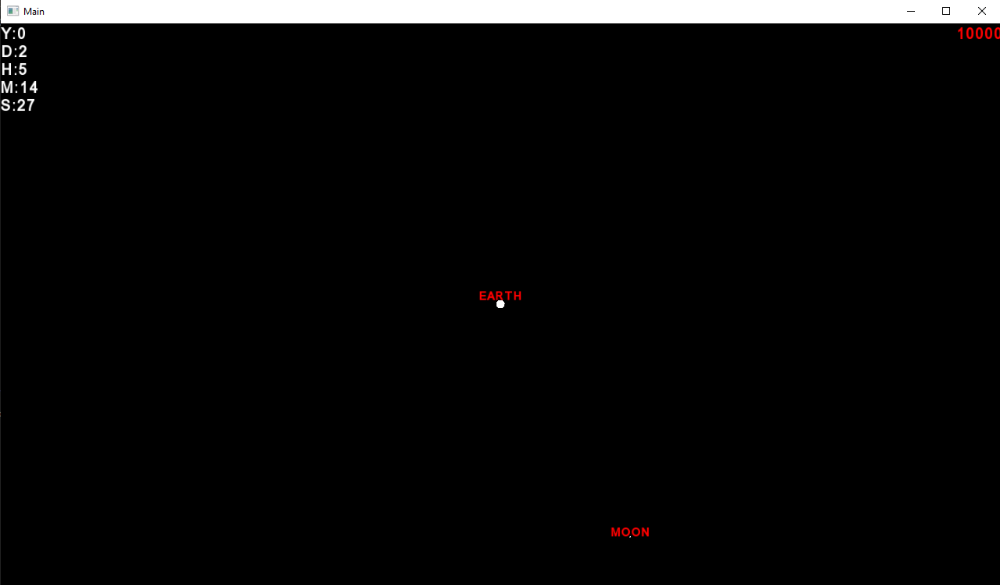
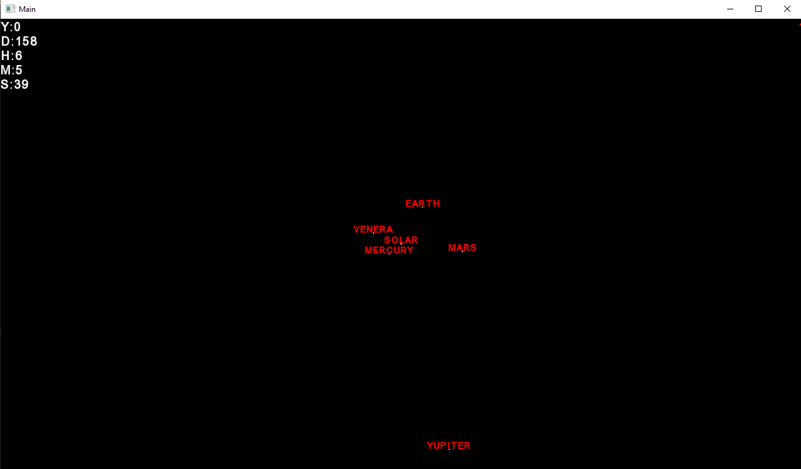
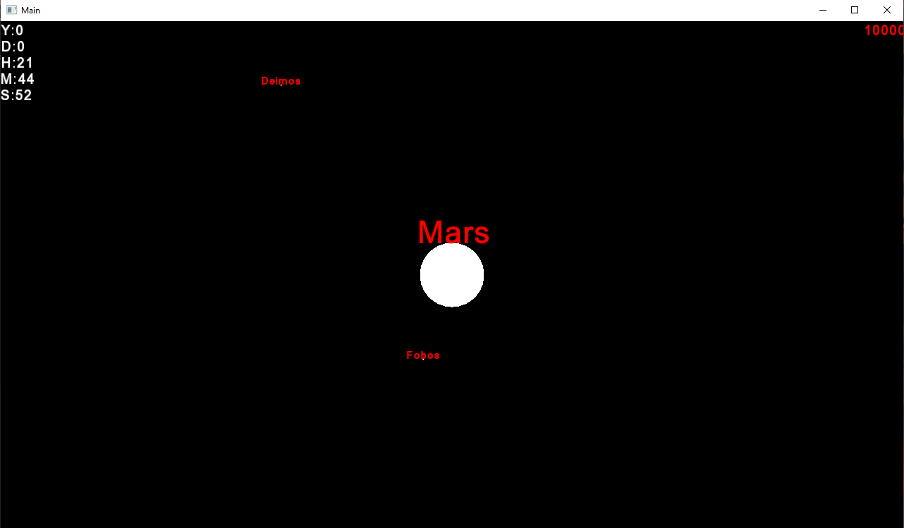

# Planetarium

A 2D gravity simulation program that utilizes the Boost and SFML libraries to model gravitational interactions. This program is designed to simulate the laws of gravity in a two-dimensional space, enabling users to experiment with various scenarios and observe the effects of gravitational forces.

## Table of Contents
- [Installation](#installation)
- [Usage](#usage)
- [Screenshots](#screenshots)
- [License](#license)
## Installation
To install the Gravity Simulation Program, follow these steps:

1. Clone the repository: `git clone https://github.com/adidvar/Planetarium.git`
2. Navigate to the project directory: `cd Planetarium`
3. Create a build directory: `mkdir build && cd build`
4. 5. Generate build files using CMake: `cmake . -S ..`
5. Install dependencies using Conan: `conan install .`
6. Generate build files using CMake: `cmake .`
7. Build the program: `cmake --build .`

## Usage
After building the program, you can run it from the command line:

```bash
./Planetarium
Load simulation from *.oldsystem files and start it using ENTER + "start {speed}" command.

```

## Screenshots




## License
This project is licensed under the GNU General Public License v3.0 (GPL-3.0). See the LICENSE file for more details.
